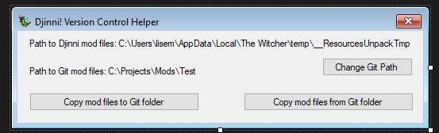

## Djinni! Version Control Helper 

## Description

Djinni! Version Control Helper is a tool which will help you use Version Control Systems with your mods for The Witcher. When you open Djinni! project, all content of your mod is extracted to special temporary directory _ResourcesUnpackTmp. When you work with editor, you work on those files, but if you click „Save module”, Djinni! Editor packs all files to .ADV file. When you close editor, all those files are packed but if you will crash editor, those files are still avalible, and you can send them on Git server. That’s what Djinni! Version Control Helper does. It will crash Djinni! Editor and then it will copy all your project files to your Git directory. The application works in a simple way, downloads to the collection a list of all processes running in the system and if it finds the process of the Djinni editor it closes it. Created as Windows Forms application.

